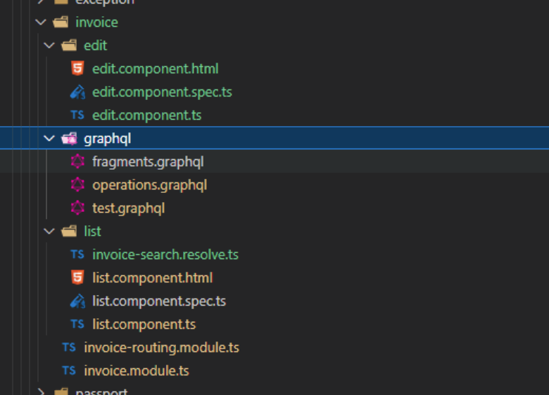

# CLi命令生成模块代码

支持以下命令生成模块
```cs
# 创建一个名字为Book的模块
npx ng g ng-alain:module book

# 为Book模块创建 graphql实体文件
npx ng g ng-alain:tpl graphql graphql -m=book --modal=false

# 为Book模块创建列表页
npx ng g ng-alain:tpl list list -m=book --modal=false -- '[{\"title\":\"books\"},{\"module\":\"book\"}]'

# 为Book模块创建编辑页
npx ng g ng-alain:tpl edit edit -m=book --modal=false  -- '[{\"title\":\"books\"},{\"module\":\"book\"}]'


# Book 模块下生成一个 BookListComponent List组件
npx ng g ng-alain:list list -m=book
# Book 模块下生成一个 BookEditComponent List组件 及 BookService 服务类
npx ng g ng-alain:list list -m=book --service=root
# Book 模块下生成一个 BookEditComponent Edit组件
npx ng g ng-alain:edit edit -m=book

```


