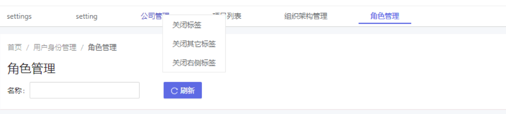

# 多标签路由reuse-tab




```ts

    throwIfAlreadyLoaded(parentModule, "GlobalConfigModule");
    // NOTICE: Only valid for menus with reuse property
    // Pls refer to the E-Mail demo effect
    reuseTabService.mode = ReuseTabMatchMode.MenuForce;
    // Shouled be trigger init, you can ingore when used `reuse-tab` component in layout component
    reuseTabService.init();
```
